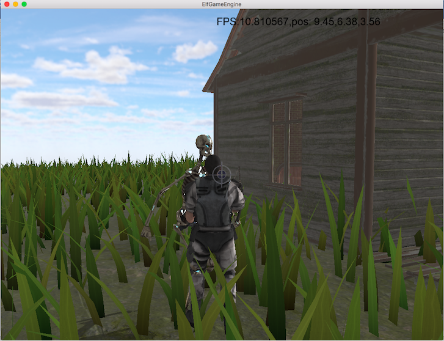
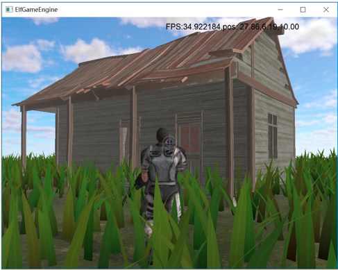

The Elf Game Engine
========================

# Introduction

The Elf Game Engine (ElfGE) is a full-functional game engine based
on modern C++ and OpenGL, it is cross-platform and compatible with
any device that support OpenGL. 

The ElfGE provide an hierarchical game object and component model, 
which is useful for abstraction of your game. An event-loop based
logic processing system is built in our engine. We also
provide rich built-in components for accelerating your development,
including lighting, physics engine, collision detection, skeletal animation, particle effect, dynamic water surface, multiple material, shadow mapping and interactive UI system.

Please feel free to clone or fork this project.

# Example

Here are some example for ElfGE, we built a simple FPS game
using ElfGE and its built-in components. Here are our game
screenshots.





# How to Use

Requirement: cmake(>=3.6), gcc(>=5), glew, glfw3, assimp, freetype 

## for macOS users

we recommend use `homebrew` to install all dependencies

```bash
brew update
brew install cmake gcc glew glfw assimp freetype
```

## for linux users

linux users could use apt-get or yum or pacman to install package.
for example, ubuntu users could use the following commands:
```bash
sudo apt-get update
sudo apt-get install cmake libglew-dev libglfw3 libassimp-dev libfreetype6 libfreetype6-dev
```

After installation of all requirement packages, you can use cmake
to compile our project according to our CMakeList.txt


# How to Develop

## Add/Change a scene

The default scene setting is located in `Assets/Entry.cpp`, you could
just add a new scene file, and change the setting.

At runtime, using `Runtime::setScene(Scene *scene)` to change the
scene.

## Add a new component

It is easy for you to add any component. First, you should add your
own component `.h` file and `.cpp` file. Then, add a class that extend class `Component`. There is no necessary method for your to
implement in subclass. Normally, you should override `start()` and
`update()` method for your purpose, and override `updateGraphics()`
if you would like to draw sth.

## Make a Scene

For any scene object, it should implement `start()`, `update()` and 
`destroy()`, you should do correct thing in these functions. For example, in `start()` function, you could do some initialization like
`createGameObject()` or `createComponent()`, in `update()` function,
you could translate your object using statements like 
`obj.transform.translate(glm::vec3(1,0,0))`.

## The hierarchy of our components

The following graph introduce the base inheritance relation of ElfGE


# Miscellaneous
This project is a course project for Computer Graphics (Fall 2017)
in Zhejiang University. please do not use this project as your
homework for any course, which could be regard as plagiarism.
